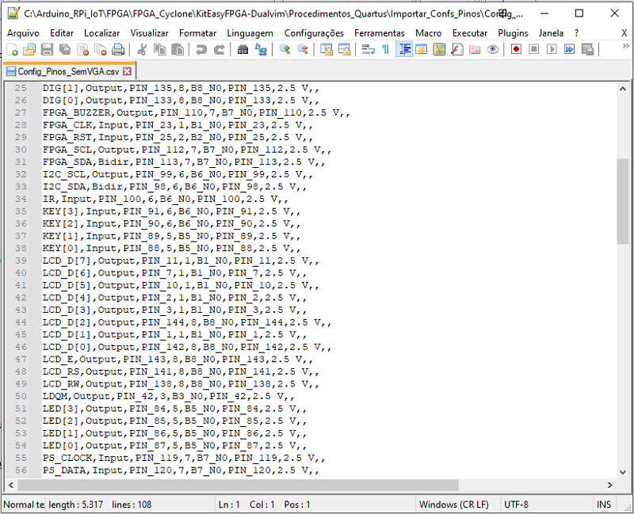
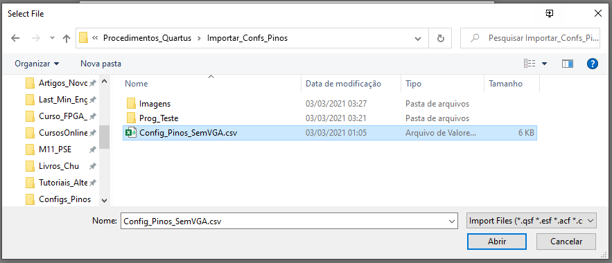
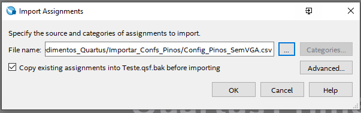
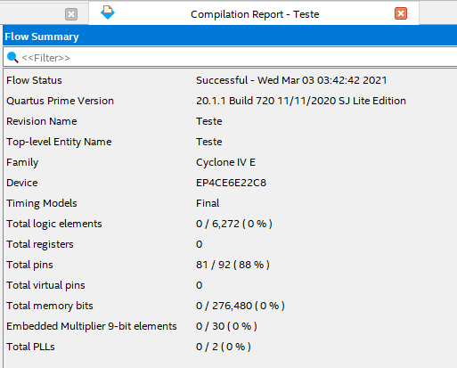
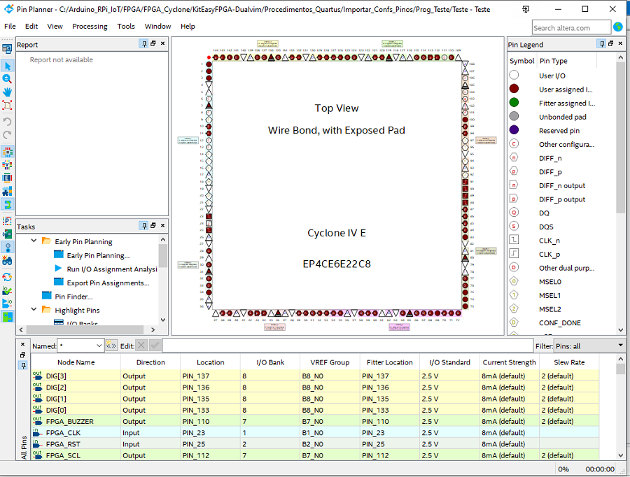

# Importar as configurações dos pinos salvas em um arquivo `.csv`         
 - O resultado do procedimento de importação apresentado aqui está no arquivo **`Output_Pin_Planner.pdf`**.       
        

# 1 - Arquivo com as configurações dos pinos do kit FPGA:       
       
        
 - O arquivo **`Config_Pinos_SemVGA.csv`** contém as configurações dos pinos do kit RZ-EasyFPGA A2.2.      
 - Esse arquivo será importado ao projeto do Quartus.       
          

# 2 - Importar as configurações do arquivo `.csv` no projeto        
       
        
       
        

       
        

# 3 - Visualizando o resultado da importação no arquivo `Teste.qsf`
       
        

# 4 - Programa de teste:       
       
         
```        
module Teste(
	///////// Clocks /////////
      input              FPGA_RST,
      input              FPGA_CLK,
      ///////// Botoes /////////
      input    [3: 0]   KEY,
      ///////// LEDs /////////
      output   [3: 0]   LED,
      /////////Display de 7 segmentos/////////
      output   [3: 0]   DIG,
      output   [7: 0]   SEG,
      ///////// SDRAM /////////
      output             SDRAM_CLK,
      output             SDRAM_CKE,
      output   [11: 0]   SDRAM_A,
      output   [ 1: 0]   SDRAM_BS,
      inout    [15: 0]   SDRAM_DQ,
      output             LDQM,
      output             UDQM,
      output             SDRAM_CS,
      output             SDRAM_WE,
      output             SDRAM_CAS,
      output             SDRAM_RAS,
	///////// LCD /////////
	output             LCD_RS,
	output             LCD_RW,
	output             LCD_E,
	output   [7: 0]   LCD_D,
	///////// UART /////////
	input              UART_TXD,
	output             UART_RXD,
	///////// PS/2 /////////
	input              PS_CLOCK,
	input              PS_DATA,
	///////// Interface I2C /////////
      output             I2C_SCL,
      inout              I2C_SDA,
	output             FPGA_SCL,
      inout              FPGA_SDA,
	///////// Outros /////////
	input              IR,
	output             FPGA_BUZZER
	
);

	//Acender os LEDs de acordo com o botao pressionado
	assign LED[0] = ~KEY[0];
	assign LED[1] = ~KEY[1];
	assign LED[2] = ~KEY[2];
	assign LED[3] = ~KEY[3];
endmodule
```        
          
       
         


# configurações importadas no _Pin Planner_      
       
        

       
        

