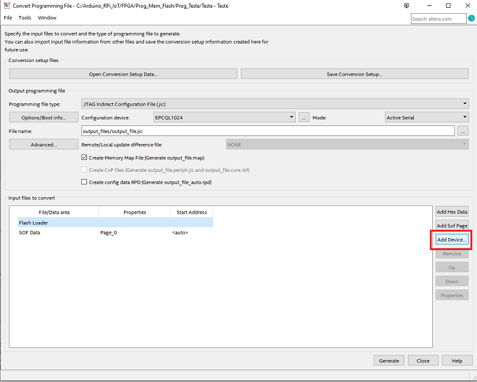
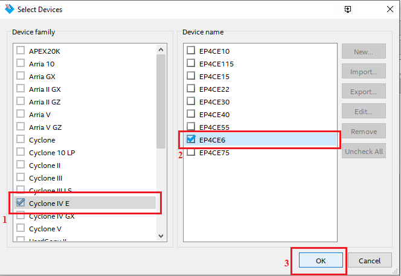
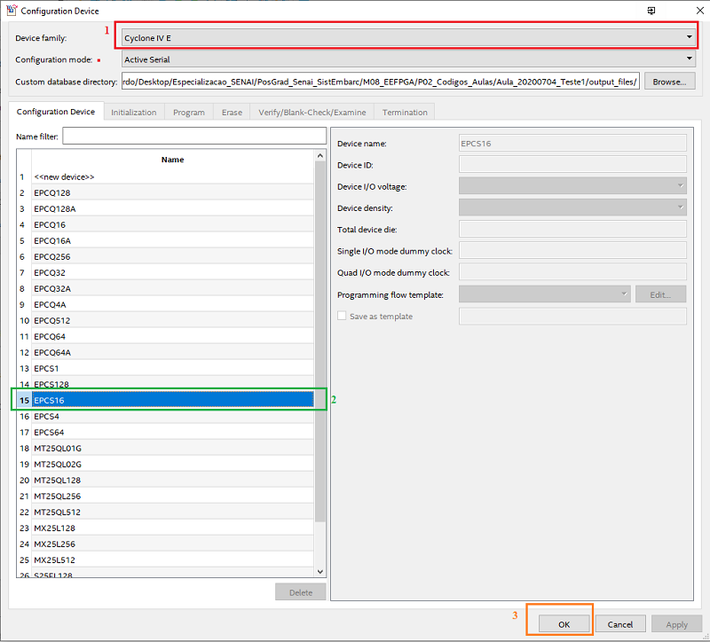
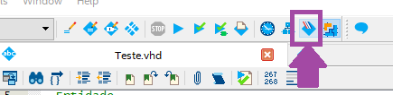
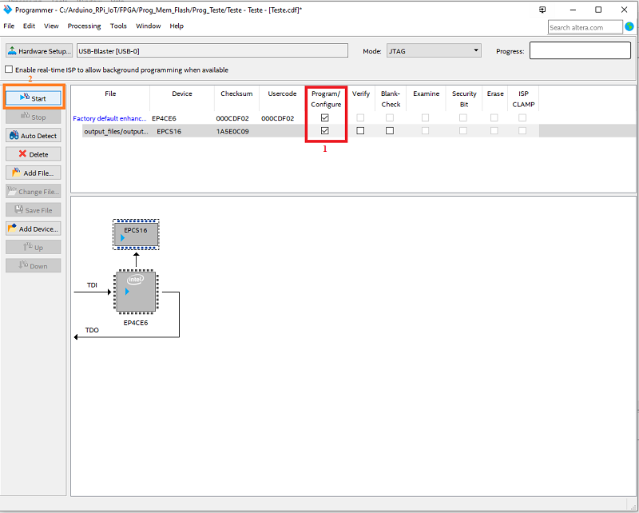
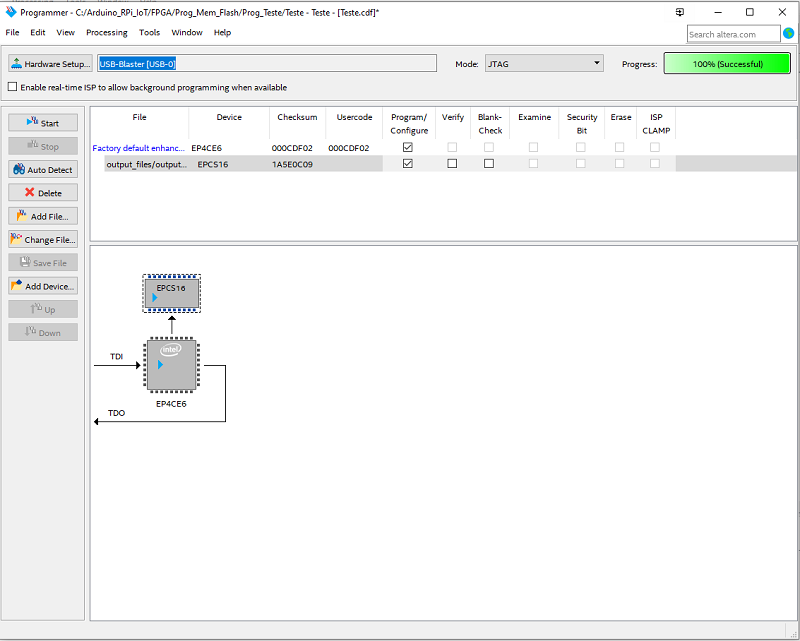

# Salvar um programa na memória flash do kit RZ-EasyFPGA A2.2:       
 - Ao enviar o programa compilado para a memória flash, quando a placa FPGA for desligada e religada novamente, o programa será mantido na memória da placa.      
 - Se houver um programa sdalvo nessa memória, então assim que a placa FPGA for ligada, o programa salvo nela começará a ser executado.       
       

# 1 - Criar o arquivo `.jic`         
        
              

        
            

        
            

        
            

        
         

        
         

        
         

        
         

# 2 - Enviar o programa para a memória compilada       
        
              

        
              

        
              

        
              

        
              