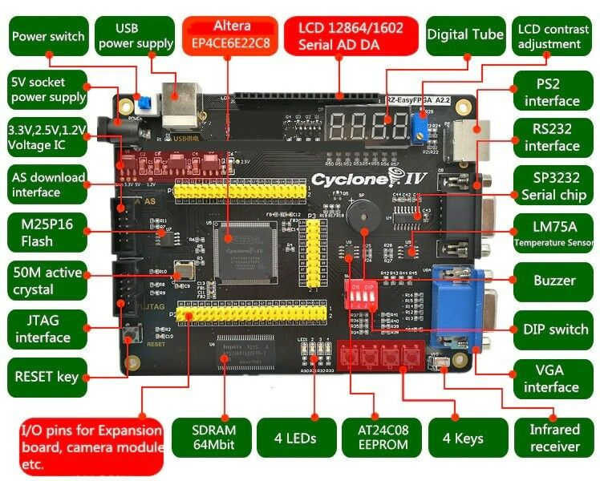

# Sobre esse Repositório (_Branch_ criado por Dualvim):      
 - Esse repositório é um _fork_ do repo criado pelo professor Felippo Valiante Filho. [Repositório original](https://github.com/filippovf/KitEasyFPGA)     
 - O objetivo primário desse repo é criar um local para reunir documentos traduzidos para o português, e também compartilhar códigos em VHDL e em Verilog que executem no kit FPGA RZ-EasyFPGA.        
 - Sugestões e colaborações sempre serão bem-vindas aqui.     
 - Quanto a dúvidas, elas podem ser perguntadas lá na aba **Issues**. Por estar estudando FPGAs a pouco tempo, não serão todas a que poderei responder, mas nada impede de procurar pela solução.        
          - Caso alguém se sita confortável em responder alguma dúvida não respondida, que fique a vontade para responder.         
 - Todos os exemplos disponibilizados aqui foram testados no kit FPGA **EZ-EasyFPGA A2.2**, que utiliza o **CI FPGA Altera Cyclone IV EP4CE6E22C8N** e podem ser executados em outros CIs FPGA, desde que realizadas as modificações necessárias no projeto do Qartus Prime.        
 - A ferramenta de desenvolvimento utilizada aqui é a **Intel Quartus Prime Lite**, versão gratuita, que pode ser obtida em https://fpgasoftware.intel.com/?edition=lite.           
 - Sobre o conteúdo disponibilizado aqui:          
	- **Pasta `Docs_Kit`**: Arquivos com vários arquivos referentes a documentação, tais como:     
		- Diagrama equemático do kit, traduzido para o português.        
		- _Datasheets_ dos principais CIs dentro do kit.    
		- Arquivos com as configurações dos pinos, prono para ser importado nos projetos do Quartus Prime (por meio da ferramenta _Pin Planner_).           
	- **Pasta `Exemplos_VHDL`**: Contém alguns exemplos de projetos executados nesse kit usando a linguagem VHDL.        
	- **Pasta `Procedimentos_Quartus`**: Exemplos mostrando como usar alguns recursos importantes do Quartus.     
		- Como salvar um programa na memória flash do kit FPGA.         
		- Como importar as configurações dos pinos usando a ferramenta _Pin Planner_ do Quartus Prime.         
	

# Links com referências e documentos pertinentes ao kit RZ-EasyFPGA A2.2:         
 - Fabricante do kit: RZRD     
	- Site (em chinês): http://www.rzrd.net/      
	- Página do Kit (em chinês): http://www.rzrd.net/product/?79_502.html       
 - Site com **_Learning Materials_** do kit para download: http://fpga.redliquid.pl/      
 - Anúncio do site [BangGood](https://www.banggood.com/ALTERA-Cyclone-IV-EP4CE6-FPGA-Development-Board-Kit-Altera-EP4CE-NIOSII-FPGA-Board-and-USB-Downloader-Infrared-Controller-p-1622523.html?utm_source=google&utm_medium=cpc_ods&utm_content=suzy&utm_campaign=suzy-sds-7hotsale-0416&ad_id=431632765347&gclid=CjwKCAiAq8f-BRBtEiwAGr3DgeKJ2Rt23AdT5OcQP6tcpGYCOlunE4ZYTL-AukQ7KjPGcVgdonCzuRoCNY4QAvD_BwE&cur_warehouse=CN), com outros _Learning Materials_ disponíveis para download:   
	- http://myosuploads3.banggood.com/products/20200715/20200715214029manual1.rar       
	- http://myosuploads3.banggood.com/products/20200715/20200715225938manual2.rar        
	- http://myosuploads3.banggood.com/products/20200716/20200716015352manual3.rar         
	- http://myosuploads3.banggood.com/products/20200716/20200716221102manual4.rar       
	- http://myosuploads3.banggood.com/products/20200717/20200717013819manual5.rar         
	 

# Sobre o Kit FPGA  **RZ-EasyFPGA A2.2** (conteúdo do repositório origiginal)   
 - Kit de desenvolvimento FPGA com o CI FPGA **Altera (Intel) Cyclone IV EP4CE6E22C8**.         
	- Em tempo, o "N" no final do código gravado no componente é apenas algo como a versão "normal" do componente.         
	- Esse Kit Easy FPGA tem um baixo custo e é bem popular nos sites de compras chineses e no Mercado Livre.           
	- Como a documentação que vem junto com o kit deixa bastante a desejar, a intenção deste repositório é fornecer um pouco de documentação confiável em português para auxiliar aqueles que adquiriram (ou pensam em adquirir) esse produto.        
          
       
        
 - Voltando à placa, uma breve análise mais pessoal. Comprei a minha na virada de 2016 para 2017, mas o mesmo modelo ainda é vendido em setembro de 2020 quando publico este repositório. Eu a utilizo para algumas demonstrações e preparar alguns experimentos para aulas de Sistemas Reconfiguráveis.        
 - Alguns prós e contras na minha perspectiva (professor Felippo Valiante Filho):          
	 - **PRÓS**:
	    - Ótimo custo x benefício;
	    - Possui diversos periféricos integrados previamente;
	    - Disponibiliza todos os pinos para conexão externa / expansão;
	    - É capaz de rodar o **NIOS II**, o _soft core processor_ da Altera (atualmente propriedade da Intel).          
	- **CONTRAS**:
		- A documentação é muito ruim e suporte do fabricante inexistente;        
			- E quando encontra alguma documentação ou exemplos para serem executados nesse kit, geralmente está em chinês (Dualvim).       
		- Os botões e chaves (dip switch) estão ligados juntos, não sendo possível usá-los de modo independente. Isso obriga a frequentemente usar uma proto-board e colocar alguns botões externos.       
		 

# Material desenvolvido pelo professor Felippo Valiante Filho      
 - Site e no canal do YouTube com conteúdos sobre Computação e Lógica Reconfigurável, PLD, FPGA, VHDL, etc.
	- Site: http://prof.valiante.info/disciplinas/sistemas-digitais
	- YouTube: https://www.youtube.com/channel/UCRc9RVFIidacP89rUTiXxwA
 - Versão original do repositório: https://github.com/filippovf/KitEasyFPGA     
          
