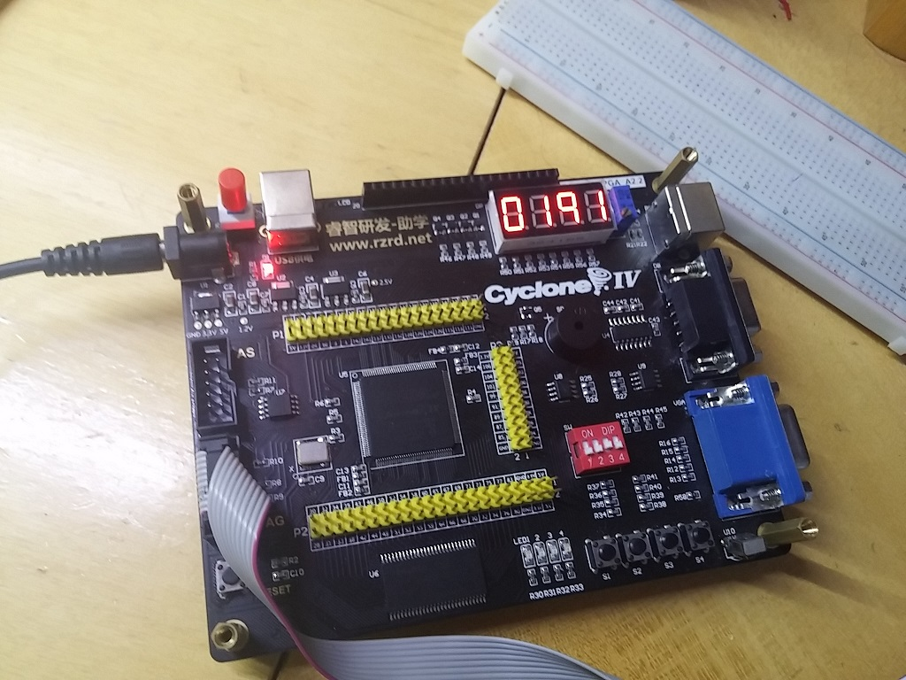

# Projeto Usando o Display de 7 Segmentos com 4 Dígitos     
 - **Objetivo**: Usar o display de 7 segmentos do kit EasyFPGA.      
	- O Display do kit Easy FPGA possui 4 dígitos numéricos.     
	- Portanto, esse script realiza uma contagem de 0 a 9999 e apresenta o número atual da cntagem no display.    
 - Sobre o display de 7 segmentos do kit EasyFPGA:     
	- Os 4 dígitos do display compartilham os pinos conectados aos segmentos.      
	- Para acender um determinado dígito desse display, é necessário:       
		- 1 - Especificar os estados dos pinos dos segmentos (que será o número a ser escrito).       
		- 2 - Especificar qual dos 4 dígitos esse número será escrito.      
 - Níveis lógicos para acender ou apagar os segmentos e os dígitos do display:        
	- **0**: Acende um segmento/dígito.      
	- **1**: Apaga um segmento/dígito.      
 - Exemplo: Escrever o número 1234 no display:      
	- 1 - Atribuir o valor **`11111001`** (1) ao array com os pinos referentes ao segmento.        
	- 2 - Atribuir o valor **0 (ligado) ao QUARTO dígito** do display e o valor 1 (desligado) para os demais digitos.      
	- 3 - Aguardar um período de 1ms.      
	- 4 - Atribuir o valor **`10100100`** (2) ao array com os pinos referentes ao segmento.        
	- 5 - Atribuir o valor **0 (ligado) ao TERCEIRO dígito** do display e o valor 1 (desligado) para os demais digitos.      
	- 6 - Aguardar um período de 1ms.    
	- 7 - Atribuir o valor **`10110000`** (3) ao array com os pinos referentes ao segmento e o valor 1 (desligado) para os demais digitos.        
	- 8 - Atribuir o valor **0 (ligado) ao SEGUNDO dígito** do display.      
	- 9 - Aguardar um período de 1ms.    
	- 10 - Atribuir o valor **`10011001`** (4) ao array com os pinos referentes ao segmento e o valor 1 (desligado) para os demais digitos.        
	- 11 - Atribuir o valor **0 (ligado) ao PRIMEIRO dígito** do display.      
	- 12 - Aguardar um período de 1ms.    
	 

# Foto do projeto em funcionamento:        
         
       
 - Um vídeo e duas fotos na pasta **`Fotos_Resultado`**.       
           

# Pinos do Kit EasyFPGA usados nesse projeto    
 - Pino referente aos pulsos do _clock_:      
	- **``**
 - Pinos referentes aos segmentos dos display de 7 segmentos:      
	- **`SEG[0]`**: Segmento **A**.      
	- **`SEG[1]`**: Segmento **B**.      
	- **`SEG[2]`**: Segmento **C**.      
	- **`SEG[3]`**: Segmento **D**.      
	- **`SEG[4]`**: Segmento **E**.      
	- **`SEG[5]`**: Segmento **F**.      
	- **`SEG[6]`**: Segmento **G**.      
	- **`SEG[7]`**: **Ponto decimal**.      	
 - Pinos referentes aos dígitos do display de 7 segmentos:      
	- **`DIG[0]` (Pino 133)**: primeiro dígito do display.     
	- **`DIG[1]` (Pino 135)**: segundo dígito do display.     
	- **`DIG[2]` (Pino 136)**: terceiro dígito do display.     
	- **`DIG[3]` (Pino 137)**: quarto dígito do display.     
	 

# Arquivos pdf com outputs:       
 - Arquivos da pasta **`Pdfs_Outputs`**:      
	- **`Compilation_report.pdf`**: Relatório decompilação do projeto.      
	- **`Output_RTL_Viewer.pdf`**: Diagrama gerado no _RTL Viewer_ do Quartus Prime Lite.    
	- **`Output_TechnologyMapViewer_PostFitting.pdf`**: Diagrama gerado no _Technology Map Viewer (Post-Fitting)_ do Quartus Prime Lite.         
	- **`Output_TechnologyMapViewer_PostMapping.pdf`**: Diagrama gerado no _Technology Map Viewer (Post-Mapping)_ do Quartus Prime Lite.         
	- **`Output_Chip_Planner.pdf`**: Mostra os ppinos do chip **EP4CE6E22C8N** usados pelo programa gerado no projeto.            
	 
